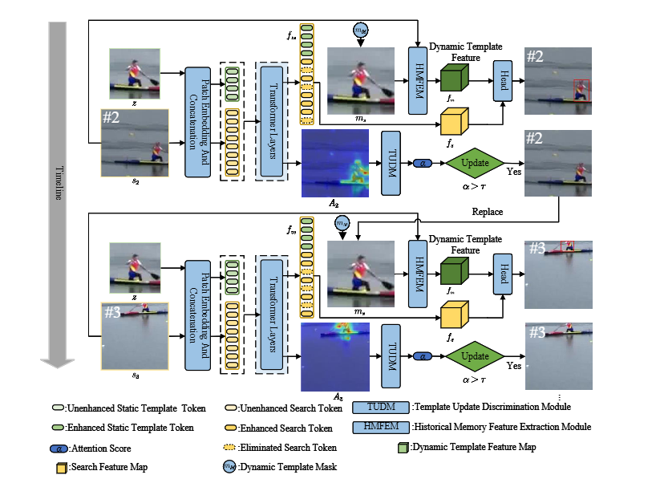
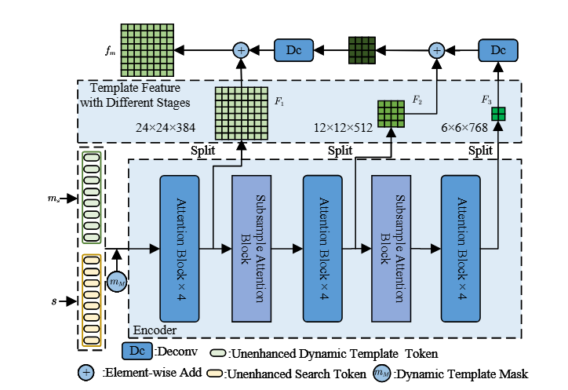

# SADRTrack: Self-Evolving Template via Static Anchor and Dynamic Refinement for Visual Tracking

Official implementation of **SADRTrack: Self-Evolving Template via Static Anchor and Dynamic Refinement for Visual Tracking**.

SADRTrack is a robust visual object tracker that combines a stable static template with a reliability-guided dynamic template. The method introduces a **Historical Memory Feature Enhancement Module (HMFEM)** for multi-scale historical feature refinement and a **Template Update Discrimination Module (TUDM)** for reliable template updating, improving tracking stability under occlusion, scale variation, fast motion, and background interference.

<div align="center">
  
</div>

## Highlights

### Introduction

Visual object tracking aims to localize a target across video frames given its initial bounding box. Existing trackers often rely on fixed templates or simple online update strategies, which may cause error accumulation and tracking drift when the target is occluded, blurred, or affected by distractors.

To address this problem, **SADRTrack** builds a self-evolving template framework by jointly exploiting:

- **Static anchor**: the initial template is preserved throughout the sequence to provide stable target identity information.
- **Dynamic refinement**: a short-term dynamic template is selectively updated only when the current observation is reliable.
- **Historical memory enhancement**: reliable dynamic template features are fused with current search features to improve target representation.

This design balances long-term stability and short-term adaptability, allowing the tracker to maintain robust localization in challenging scenarios.

### Main Components

#### Historical Memory Feature Enhancement Module (HMFEM)

HMFEM fuses multi-layer features from the reliability-verified dynamic template. It introduces a mask-guided historical representation and aggregates hierarchical features from different stages to enhance the current search representation.

<div align="center">
  
</div>

#### Template Update Discrimination Module (TUDM)

TUDM evaluates the reliability of the current frame by measuring the concentration of template-to-search attention. The dynamic template is updated only when the attention concentration score exceeds a predefined threshold, reducing the risk of introducing corrupted or occluded target appearances into the template memory.

#### Prediction Head

The enhanced historical feature and current search feature are fused and passed to a multi-branch prediction head, including center, offset, and size branches, for accurate target localization.

## Performance

### GOT-10k, TrackingNet, and LaSOT

| Method | LaSOT AUC | LaSOT PNorm | LaSOT P | TrackingNet AUC | TrackingNet PNorm | TrackingNet P | GOT-10k AO | GOT-10k SR<sub>0.5</sub> | GOT-10k SR<sub>0.75</sub> |
| --- | ---: | ---: | ---: | ---: | ---: | ---: | ---: | ---: | ---: |
| **SADRTrack** | **71.7** | **81.8** | **78.1** | **84.3** | **88.8** | **83.2** | **76.8** | **87.7** | **73.1** |

### UAV123, NFS30, and OTB2015

| Method | UAV123 AUC | NFS30 AUC | OTB2015 AUC |
| --- | ---: | ---: | ---: |
| **SADRTrack** | **71.2** | **68.2** | **70.3** |

## Quick Start

### Data Preparation

Put the tracking datasets under `./data`. The directory structure should look like this:

```text
${PROJECT_ROOT}
|-- data
|   |-- lasot
|   |   |-- airplane
|   |   |-- basketball
|   |   |-- bear
|   |   |-- ...
|   |-- got10k
|   |   |-- test
|   |   |-- train
|   |   |-- val
|   |-- coco
|   |   |-- annotations
|   |   |-- images
|   |-- trackingnet
|   |   |-- TRAIN_0
|   |   |-- TRAIN_1
|   |   |-- ...
|   |   |-- TRAIN_11
|   |   |-- TEST
```

### Environment

The implementation is based on Python and PyTorch. The experiments in the paper use a ViT-B backbone initialized with DropTrack pre-trained weights.

```bash
conda env create -f SADRTrack_env_cuda113.yaml
conda activate sadrtrack
```

If your repository still keeps the original environment file name, use:

```bash
conda env create -f SADRTrack_env_cuda113.yaml
```

### Set Project Paths

Run the following command to generate default local configuration files:

```bash
python3 tracking/create_default_local_file.py --workspace_dir . --data_dir ./data --save_dir ./output
```

You can also manually modify the dataset and output paths in:

```bash
lib/train/admin/local.py       # training paths
lib/test/evaluation/local.py   # evaluation paths
```

## Training

### Training on datasets except GOT-10k

Download the DropTrack pre-trained weights and put them under:

```text
${PROJECT_ROOT}/pretrained_models
```

Then run:

```bash
python3 tracking/train.py --script sadrtrack --config sadrtrack --save_dir ./output --mode multiple --nproc_per_node 4
```

### Training on GOT-10k

For GOT-10k training, use the GOT-specific configuration:

```bash
python3 tracking/train.py --script sadrtrack --config sadrtrack_got --save_dir ./output --mode multiple --nproc_per_node 4
```


## Evaluation

Before evaluation, set the dataset paths in `lib/test/evaluation/local.py`.

### LaSOT / UAV123 / NFS30 / OTB2015

```bash
python3 tracking/test.py sadrtrack sadrtrack --dataset lasot --threads 16 --num_gpus 4
python3 tracking/analysis_results.py
```

Change `--dataset` to evaluate on other benchmarks, for example:

```bash
python3 tracking/test.py sadrtrack sadrtrack --dataset uav --threads 16 --num_gpus 4
python3 tracking/test.py sadrtrack sadrtrack --dataset nfs --threads 16 --num_gpus 4
python3 tracking/test.py sadrtrack sadrtrack --dataset otb --threads 16 --num_gpus 4
```

### GOT-10k Test

```bash
python3 tracking/test.py sadrtrack sadrtrack_got --dataset got10k_test --threads 16 --num_gpus 4
python3 lib/test/utils/transform_got10k.py --tracker_name sadrtrack --cfg_name sadrtrack_got
```

### TrackingNet

```bash
python3 tracking/test.py sadrtrack sadrtrack --dataset trackingnet --threads 16 --num_gpus 4
python3 lib/test/utils/transform_trackingnet.py --tracker_name sadrtrack --cfg_name sadrtrack
```


## Implementation Details

- Backbone: ViT-B
- Template size: `192 x 192`
- Search size: `384 x 384`
- Optimizer: AdamW
- Initial learning rate: `1e-4`
- Weight decay: `1e-4`
- Training epochs: `100`
- Batch size: `4`
- Learning rate decay: `1e-5` at epoch `80`
- TUDM update threshold: `0.15`
- Training datasets: COCO, LaSOT, GOT-10k, TrackingNet


## Acknowledgement

This project is developed based on the tracking framework used by several open-source trackers. We thank the authors of the following repositories for their excellent work:

- [PyTracking](https://github.com/visionml/pytracking.git)
- [OSTrack](https://github.com/botaoye/OSTrack.git)
- [HIPTrack](https://github.com/WenRuiCai/HIPTrack.git)
- [STMTrack](https://github.com/fzh0917/STMTrack.git)
- [STCN](https://github.com/hkchengrex/STCN.git)
- [STM](https://github.com/seoungwugoh/STM)

## Contact

For questions about this project, please contact the authors.
